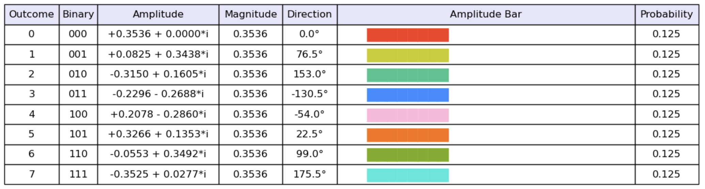
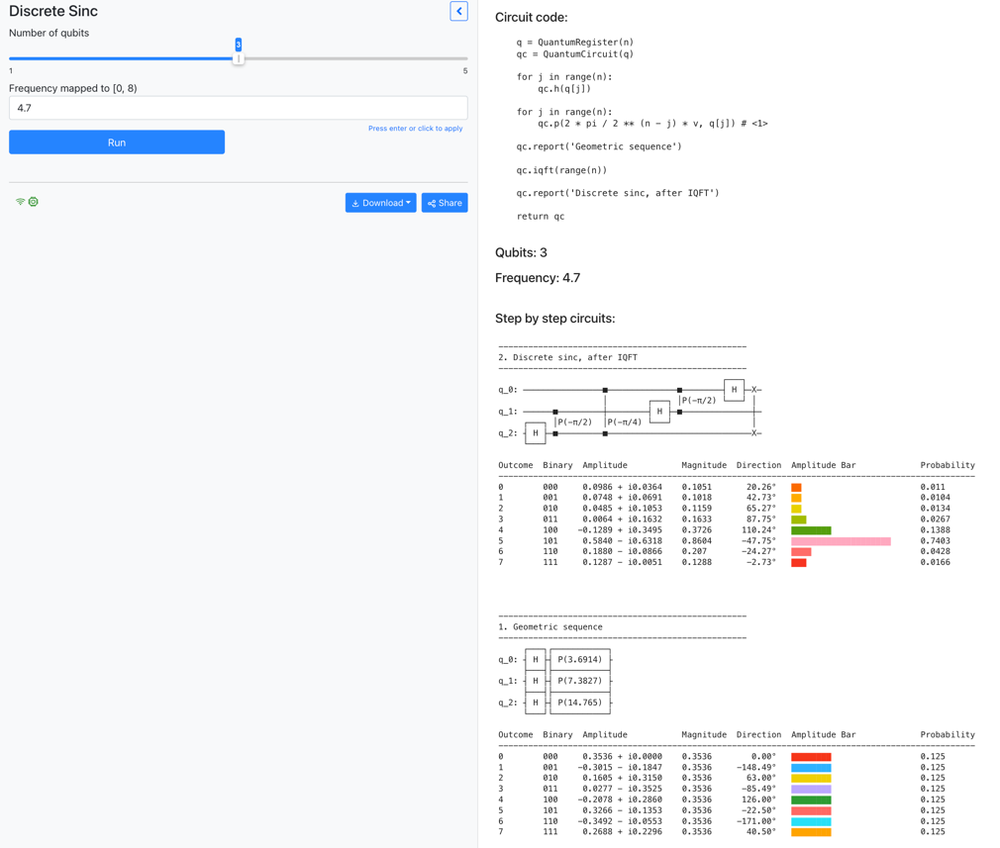

## About the code in this repository

> [!NOTE]
> This repository is a work in progress--more comments and notes will be added

* The code uses minimal dependencies, in order to facilitate learning and ensure longevity
* The code behind notebooks is built incrementally in each chapter following sound dependency management principles
* The notebooks only use code dependencies in the chapter they belong to
* There is a simulator, called Hume, that puts together all pieces, and is usable as a standalone simulator

The topics that will be covered in the chapters (roughly) from bottom to top:


#### Overview of contents and structure 


<pre>
├── README.md
├── src                            # notebooks are designed to run from the src directory
│   ├── chXX
│   │   ├── chXX.ipynb             # notebook with chapter code that can be used for experimentation
│   │   ├── chXX_output.ipynb      # notebook that includes the output of chXX.ipynb after being run (can be used for comparison)
│   │   ├── chXX_exercises.ipynb   # notebook with chapter exercises and solutions
│   │   ├── chXX_qiskit.ipynb      # notebook with examples run with Qiskit (starting in chapter 4)
│   │   └── x.py                   # the source code introduced in each chapter
│   ├── ...
</pre>


#### Qiskit notebooks

The Python simulator implemented in the book uses identical syntax to Qiskit so that it can be used to run on Qiskit backends/real computers.
We include notebooks called `chXX_qiskit.ipynb` with examples from each chapter to demonstrate how to easily use the code from the book to experiment with Qiskit.

We use a small adapter to ensure that identical syntax can be used with Qiskit.
For example, the `run` method on a circuit works the same way.

Running an example circuit using our Python simulator:

```
from sim_circuit import QuantumRegister, QuantumCircuit
from math import pi

def geometric_sequence_circuit(n, v):
    theta = v*2*pi/2**n

    q = QuantumRegister(n)
    qc = QuantumCircuit(q)

    for j in range(n):
        qc.h(q[j])

    for j in range(n):
        qc.p(2 ** j * theta, q[j])

    return qc
    
n = 3
v = 1.7
qc = geometric_sequence_circuit(n, v)
state = qc.run()
```

Output:



Running an example circuit using Qiskit:

```
import qiskit
from qiskit import QuantumCircuit, QuantumRegister, transpile

def run(self):
    backend = qiskit.Aer.get_backend('statevector_simulator')
    circ = transpile(self, backend)
    job = backend.run(circ)
    state = job.result().get_statevector()
    return state

setattr(QuantumCircuit, 'run', run)

def geometric_sequence_circuit(n, v):
    theta = v*2*pi/2**n

    q = QuantumRegister(n)
    qc = QuantumCircuit(q)

    for j in range(n):
        qc.h(q[j])

    for j in range(n):
        qc.p(2 ** j * theta, q[j])

    return qc
    
n = 3
v = 1.7
qc = geometric_sequence_circuit(n, v)
state = qc.run()
```

Output:


#### Hume tests

Tests can be run with `pytest` from the `src` directory. For example:

    python -m pytest hume --no-header  -qs

Or a more specific test file:

    python -m pytest hume/tests/test_unitary.py --no-header  -qs

Or a more specific test:

    python -m pytest hume/tests/test_util_qiskit.py::test_same_as_qiskit --no-header --no-summary -qs

#### Hume experiments 

The `src/experiments` folder contains interactive mercury notebooks. The `src` folder needs to be added to the PYTHONPATH environment variable.

##### Single-qubit experiments


[video](videos/single_qubit_experiments.mp4)

##### Frequency encoding experiments



