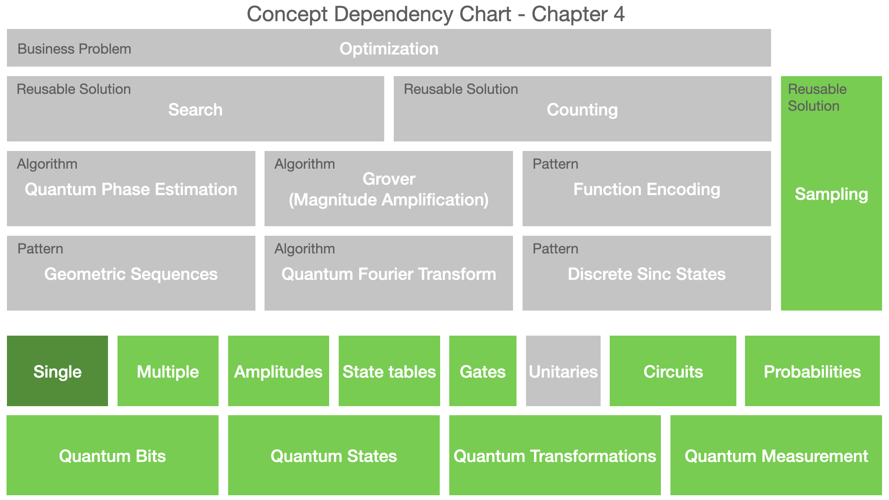

# Multi-qubit systems

The concepts covered in this chapter are highlighted in the dependency chart below. 
This chapter covers the same concepts as in chapter 3 in the context of more that one qubit.

### Practitioner insights

* Each qubit represents a digit in the possible measurement outcomes of the system. An n-qubit system has 2 to the power n possible outcomes.
* The state of an n-qubit system consists of a probability with direction (amplitude) for each outcome.
* Elementary (single-qubit) gates change amplitudes in pairs. The pairs of outcomes whose amplitudes are being changed by a gate differ in the binary digit represented by the target of the gate.
* The application of an elementary gate to a quantum system is similar to the butterfly operation is the Fast Fourier Transform algorithm.
* We want to build a simulator that is as simple as possible, starting with a functional core, and wrapping it with an object-oriented circuit implementation.
* A circuit consists of registers and quantum transformations. 

