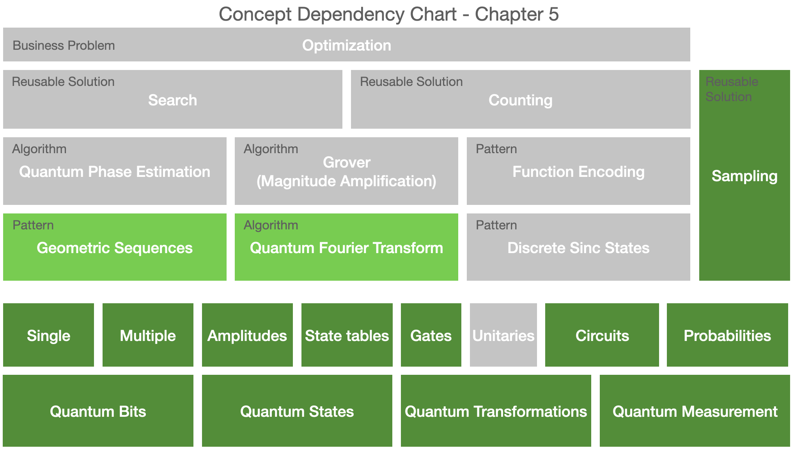

# Quantum Fourier transform

The concepts introduced in this chapter are highlighted in the dependency chart below.

### Practitioner insights

* Geometric sequence states are the equivalent of single-frequency signals (complex sinusoids) in digital signal processing.
* The inverse quantum Fourier transform of a geometric sequence state is a state that shows up over and over in quantum computing. 
* The magnitudes of this state match the (normalized) values of the discrete sinc function.

