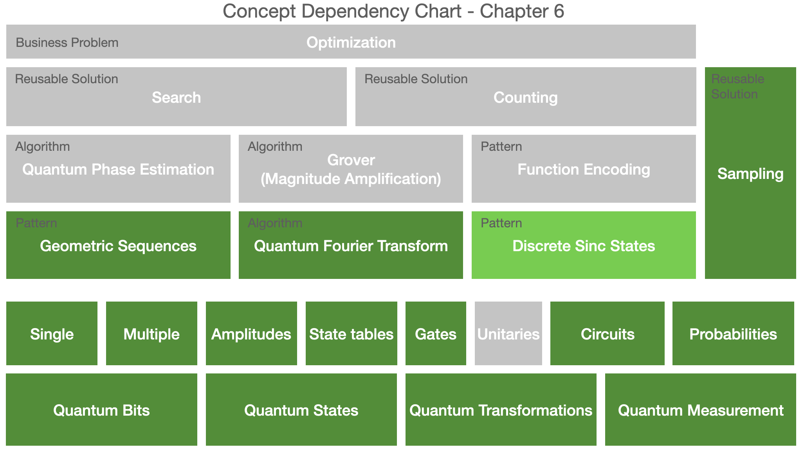

# Applications of the quantum Fourier transform

The concepts introduced in this chapter are highlighted in the dependency chart below.

### Practitioner insights

* The quantum Fourier transform and its inverse can be used to prepare useful probability distributions as quantum states.

