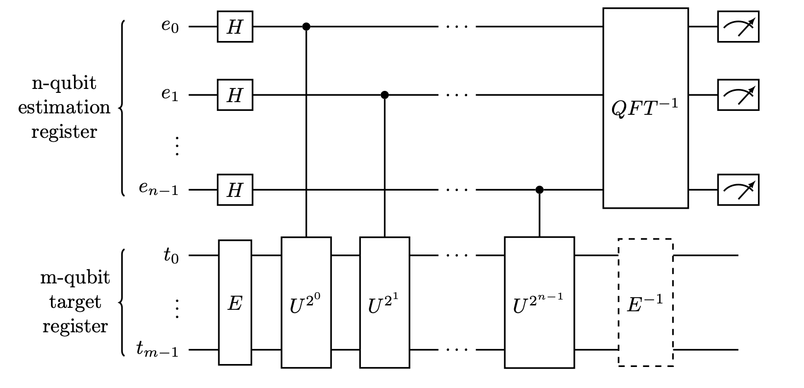
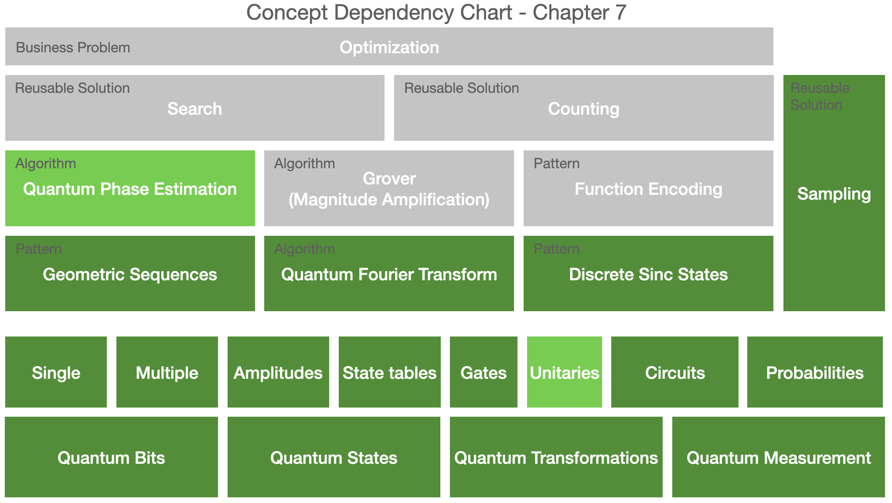

# Quantum Phase Estimation

This chapter presents the quantum phase estimation algorithm.

Where QPE fits in the book plan:

### Insights

Based on our experience as quantum computing practitioners, we are introducing three important techniques:

1. The qubit swapping in IQFT can be avoided if the controlled rotation circuit (unitary) is applied to the estimation qubits in reversed order.
2. The end state is a phased discrete sinc state if we apply the inverse of the eigenstate preparation circuit E.
3. Any estimation procedure for discrete sinc state can be applied, including interpolation methods.